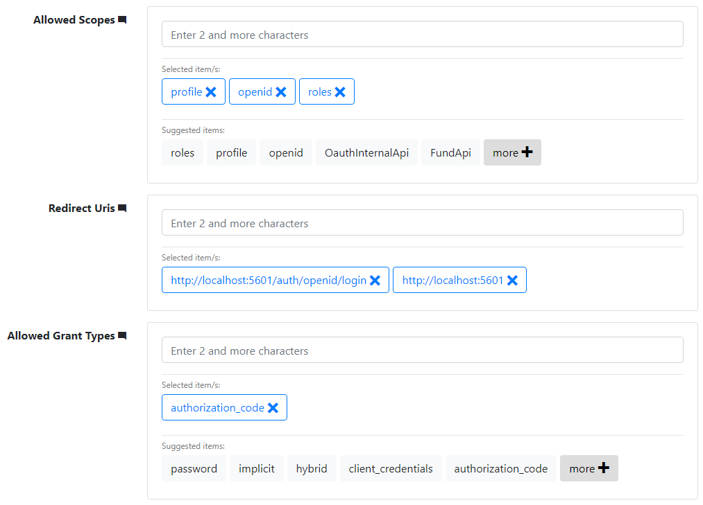

# ElasticIdentityServer4
This tutorial shows the way to connect the Elastic stack (Elastic Search and Kibana) to your IdentityServer4 solution to make the users login to the Kibana by IdentityServer4

## Introduction
In some cases, software teams need to make an integration between Elastic and IdentityServer to let their users login throught the IdentityServer to the Elastic stack. This tutorial shows the way to shape such an integration.

## IdentityServer4 preparation
In order to make it easier to add news clients, scopes, etc., the [IdentityServer4 admin panel](https://github.com/skoruba/IdentityServer4.Admin) is recomended. 

### Client configuration
When running the project, you need to define a new client, with the id of `elastic-mvc` and the name of `ElasticSearch`, for instance, as shown below:


For the nest step, add the `profile`, `openid` and `roles` as he allowed scopes. Then add the `http://localhost:5601/auth/openid/login` and `http://localhost:5601` URLs as the Redirect Uris. The allowed grnt type must be set to `authorization_code`, as shown below:



Also, you need to set a client secret, such as `elk-secret` for your client.

### User configuration
In addition to the client, it is needed to add two new roles. One is required to be named as `kibanauser` and the other one is optional to be named as `hr` (stands for Human Resource). After this step, add a user and assing the mentioned roles to her.


## Elastic preparation
The Elastic, by default, does not support external login. To do so, it is neccesary to add the [Search Gaurd](https://search-guard.com/) as a plugin to Kibana and Elastic Search. To do so, please follow the instructions given [here](https://docs.search-guard.com/latest/installation-windows).

> Warning: In the [demo certificates section](https://docs.search-guard.com/latest/installation-windows#download-and-install-the-search-guard-demo-certificates), the files might be corrupted. If this happened, please download the certificates from [here](certificates.zip).

## Add IdentityServer4 to Elastic
In order to have the the IdentityServer4 on Elastic, it is neccesary to make some configuration as below:

### kibana.yml
Add the following lines to theconfiguration of the Kibana

```
searchguard.auth.type: "openid"
searchguard.openid.connect_url: "http://<IdentityServer4 server address>/.well-known/openid-configuration"

#The ClientId added in the IdentityServer4
searchguard.openid.client_id: "elastic-mvc" 

#The ClientSercert added in the IdentityServer4
searchguard.openid.client_secret: "elk-secret" 

#The Scopes added in the IdentityServer4
searchguard.openid.scope: "profile openid roles" 
searchguard.openid.header: "Authorization"
```

### sg_config.yml
Have the following configuration in the sg_config.yml, instead of the default configuration:

```
searchguard:
  dynamic:
    http:
      anonymous_auth_enabled: false
      xff:
        enabled: false
        internalProxies: '192\.168\.0\.10|192\.168\.0\.11' # regex pattern
        remoteIpHeader:  'x-forwarded-for'
        proxiesHeader:   'x-forwarded-by'
    authc:
      #The 'basic_internal_auth_domain' is used for external plugins and libraries such as [Metricbeat](https://www.elastic.co/products/beats/metricbeat) or [Serilog](https://github.com/serilog/serilog-sinks-elasticsearch)
      basic_internal_auth_domain:
        enabled: true
        order: 0
        http_authenticator:
          type: basic
          challenge: false
        authentication_backend:
          type: internal
      #Here is the configuration for IdentityServer4
      openid_auth_domain:
        enabled: true
        order: 1
        http_authenticator:
          type: openid
          challenge: false
          config:
            #This this the claim used as the username in IdentityServer4
            subject_key: preferred_username
            #This this the claim used as the role of the user
            roles_key: role
            openid_connect_url: http://<IdentityServer4 server address>/.well-known/openid-configuration
        authentication_backend:
          type: noop
```


